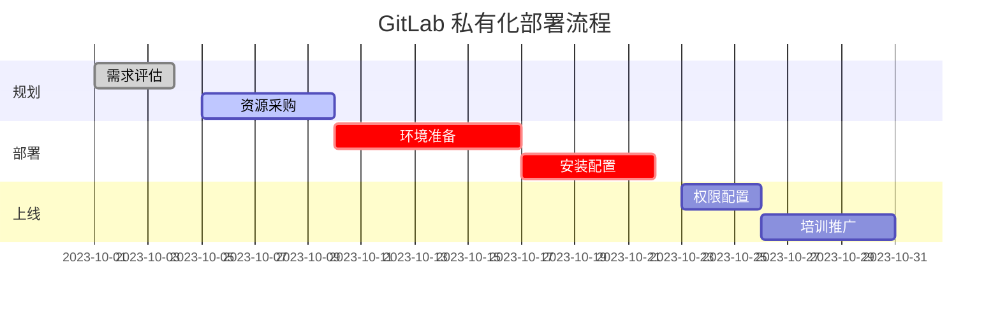

## 私有化部署 GitLab 的 **协作流程详细说明**

涵盖从规划到运维的全生命周期，明确各阶段参与角色和关键任务。

### **1. 需求评估与规划**
**参与角色**：技术负责人、项目经理、安全团队、管理层  
**关键任务**：
- **版本选择**：确定 GitLab CE（免费）或 EE（企业版，需许可证）。
- **功能需求**：是否需要高级 CI/CD、安全扫描、合规审计等（EE 功能）。
- **资源规划**：预估用户数量、存储需求（代码仓库、流水线产物）。
- **合规性**：数据存储位置（如国内服务器）、审计日志要求。
**输出**：《GitLab 部署需求文档》。

---

### **2. 环境准备**
**参与角色**：IT 基础设施团队、云服务商（如适用）  
**关键任务**：
- **服务器部署**：
  - 物理机/虚拟机配置（建议 **4核8GB内存** 起步）。
  - 云服务（如 AWS/Aliyun）资源采购。
- **依赖组件**：
  - 数据库（PostgreSQL）、Redis、对象存储（如 MinIO）。
  - HTTPS 证书（Let's Encrypt 或企业 CA）。
- **网络配置**：
  - 域名解析（如 `git.company.com`）。
  - 防火墙规则（开放 HTTP/HTTPS/SSH 端口）。
**输出**：服务器访问信息、网络拓扑图。

---

### **3. 安装与配置**
**参与角色**：DevOps 工程师、外部顾问（可选）  
**关键任务**：
- **安装 GitLab**：
  - 通过 [官方安装包](https://about.gitlab.com/install/)（CE/EE）或 Helm Chart（Kubernetes）。
  - 示例命令（Linux）：
    ```bash
    # EE 版本安装
    curl -s https://packages.gitlab.com/install/repositories/gitlab/gitlab-ee/script.deb.sh | sudo bash
    sudo EXTERNAL_URL="https://git.example.com" apt-get install gitlab-ee
    ```
- **基础配置**：
  - SMTP 邮件通知（如 Postfix 或第三方邮件服务）。
  - 备份策略（定时备份到云存储/NAS）。
- **企业版激活**：上传许可证文件（EE 版）。
**输出**：GitLab 可访问地址、管理员账号。

---

### **4. 权限与规范制定**
**参与角色**：研发负责人、项目经理、安全团队  
**关键任务**：
- **用户权限**：
  - 分组（Group）结构设计（如 `backend/frontend`）。
  - 角色分配（Developer/Maintainer/Owner）。
- **代码管理规范**：
  - 分支策略（Git Flow 或 Trunk-Based Development）。
  - 保护分支（如 `main` 分支需 MR 合并）。
- **CI/CD 模板**：预置流水线模板（构建、测试、部署）。
**输出**：《GitLab 使用规范文档》、CI/CD 示例库。

---

### **5. 培训与推广**
**参与角色**：内部培训师、研发团队  
**关键任务**：
- **培训内容**：
  - 基础操作（提交代码、MR 流程）。
  - CI/CD 流水线调试。
  - 问题跟踪（Issue/Epic 使用）。
- **推广策略**：
  - 试点团队先行，逐步全公司推广。
  - 收集反馈并优化配置。
**输出**：培训记录、常见问题手册。

---

### **6. 运维与监控**
**参与角色**：DevOps 团队、监控工具  
**关键任务**：
- **日常维护**：
  - 定期升级（如每月小版本升级）。
  - 监控服务器资源（CPU/内存/磁盘）。
- **故障处理**：
  - 日志分析（`/var/log/gitlab`）。
  - 备份恢复测试。
- **安全审计**：
  - 定期检查用户权限。
  - 扫描漏洞（如 CVE 公告）。
**输出**：运维检查表、监控告警规则。

---

### **7. 流程可视化（甘特图示例）**


---

### **关键协作建议**
1. **明确接口人**：每个阶段指定唯一负责人（如 DevOps 牵头部署，研发负责人制定规范）。
2. **文档沉淀**：所有配置和决策记录到内部 Wiki（如 GitLab 自带的 Pages 功能）。
3. **自动化优先**：使用 IaC（如 Ansible/Terraform）管理部署，减少人工干预。
